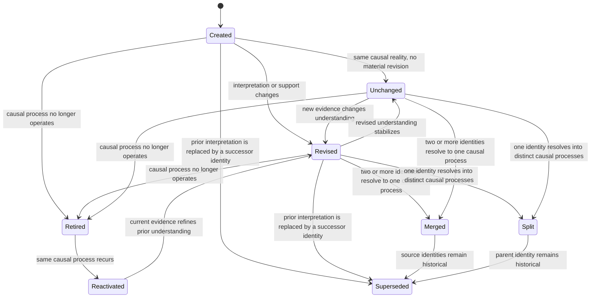

# Organizational Mechanism Lifecycle

**Status:** Canonical (Sprint 96)

---

# Purpose

This document defines the canonical longitudinal lifecycle and identity semantics for Organizational Mechanisms in Discovery.

An Organizational Mechanism explains the causal organizational process that produces or sustains one or more Organizational Phenomena. It answers:

> Why does this organizational reality exist or persist?

A mechanism is a durable cognitive object. Its identity represents the causal organizational reality, not its current label, confidence, evidence set, interpretation, or executive wording.

This document defines architecture only. It does not change production inference, Runtime, reasoning, or the Operating Model.

---

# Position in the Cognitive Pipeline

```text
Evidence

↓

Observations

↓

Signals and Contradictions

↓

Organizational Phenomena

↓

Organizational Mechanisms

↓

Beliefs

↓

Concepts and Theories

↓

Organizational Conditions

↓

Executive Assessment
```

Phenomena describe what is happening. Mechanisms explain why it is happening. Beliefs express what Discovery currently holds to be true about those mechanisms. Concepts and theories normalize and connect that understanding. Conditions and Executive Assessment interpret its executive consequence.

---

# Canonical Identity

Mechanism identity is the continuity of one causal organizational reality through changing evidence and interpretation.

Identity is preserved when Discovery improves, weakens, renames, or re-expresses its understanding of the same causal process. Identity changes only when Discovery has evidence that the causal organizational reality itself is different, has divided, or has combined with another mechanism.

The following are attributes of a mechanism, not its identity:

* label,
* title,
* executive name,
* summary,
* interpretation,
* organizational behavior wording,
* mechanism profile or type,
* confidence,
* stability,
* actionability,
* priority,
* current supporting evidence,
* current supporting signals or contradictions,
* and current executive implications.

A change to any one of these attributes must not independently create a new mechanism identity.

---

# Lifecycle Diagram



`Merged` and `Split` are transition events. Their source identities become historical and their resulting identities enter the active lifecycle as created or revised mechanisms. `Superseded` is the durable status of a mechanism whose causal meaning has been incorporated into one or more successor identities.

---

# Lifecycle States and Transitions

## Created

**Meaning:** Discovery has identified a causal organizational reality that cannot be resolved to an existing active, retired, or superseded mechanism.

**Required evidence:** At least one grounded phenomenon and sufficient causal support to distinguish the mechanism from presentation wording, taxonomy, and generic co-occurrence. Evidence must establish a causal explanation, not merely a repeated term or category.

**Historical identity:** A new identity is created. It has no predecessor unless it results from a split or merge.

**Expected Runtime representation:** The active mechanism is stored with its provenance, first-observed time, current interpretation, current confidence, and creation event. If created by merge or split, its lineage references the source identity or identities.

## Revised

**Meaning:** Discovery's interpretation, classification, scope, support, confidence, or executive expression has materially changed while the underlying causal organizational reality remains the same.

**Required evidence:** New supporting, contradictory, clarifying, decision, or outcome evidence tied to the same causal ancestry.

**Historical identity:** The mechanism ID is preserved. The prior state remains historically explainable through a revision record.

**Expected Runtime representation:** The active mechanism is updated in place by identity. A revision records what changed, why it changed, the evidence or outcome responsible, and the previous and current material state.

## Unchanged

**Meaning:** New processing does not materially alter the current understanding of the causal reality.

**Required evidence:** Either no relevant new evidence or evidence consistent with the current mechanism without a material change to interpretation, scope, confidence trajectory, or status.

**Historical identity:** The mechanism ID and material state are preserved.

**Expected Runtime representation:** The current mechanism remains active. Last-observed or last-confirmed metadata and support ancestry may advance without creating a substantive revision.

## Merged

**Meaning:** Two or more previously distinct mechanism identities are now understood to describe one causal organizational process.

**Required evidence:** Convergent causal ancestry showing that the mechanisms explain the same phenomena through the same organizational actors, relationships, scope, and causal process. Shared vocabulary or a shared profile is insufficient.

**Historical identity:** Source identities are never erased or silently reused. A resulting mechanism identity becomes canonical; all source identities are recorded as superseded by it. If one source identity already represents the combined causal reality, that identity may remain the canonical result. Otherwise a new result identity is required.

**Expected Runtime representation:** One active resulting mechanism, historical source mechanisms with `superseded` status, and a merge event connecting all source IDs to the resulting ID.

## Split

**Meaning:** One mechanism previously combined causal realities that evidence now shows are distinct and independently meaningful.

**Required evidence:** Divergent causal ancestry, organizational scope, affected entities, phenomena, or outcome behavior demonstrating at least two distinct causal processes. Different labels alone are insufficient.

**Historical identity:** The parent identity remains historical and is superseded by two or more child identities. A child must not silently appropriate the parent ID unless the evidence shows that one child is the unchanged original reality and only the other is newly discovered.

**Expected Runtime representation:** Active child mechanisms, a historical superseded parent, and a split event connecting the parent ID to every child ID.

## Retired

**Meaning:** Discovery has evidence that the causal process no longer materially operates in the organization.

**Required evidence:** Observed outcomes, sustained contradictory evidence, organizational change, or repeated absence across relevant investigations sufficient to conclude that the mechanism is no longer active. A single investigation that does not observe the mechanism is insufficient.

**Historical identity:** The identity remains durable and queryable. Retirement never deletes or renames history.

**Expected Runtime representation:** The mechanism is retained with `retired` status, retirement reason, effective time, final confidence, and supporting outcome or contradiction ancestry. It is excluded from current active mechanism reasoning unless historical context is requested.

## Reactivated

**Meaning:** A previously retired mechanism is again supported as an active causal process.

**Required evidence:** New grounded phenomena and causal support that resolve to the retired mechanism's organizational reality. Similar wording alone is insufficient.

**Historical identity:** The retired ID is reused because the same causal reality has recurred. Reactivation is not creation.

**Expected Runtime representation:** The mechanism returns to active status with the same ID. A reactivation event connects the new evidence to the prior retirement and begins a new active interval.

## Superseded

**Meaning:** A mechanism's causal meaning has been incorporated into a successor identity through an explicit merge, split, or correction of identity.

**Required evidence:** An explicit lineage resolution identifying the successor and explaining why the prior identity is no longer canonical.

**Historical identity:** The superseded ID remains immutable and queryable. It must never be reassigned to a different causal reality.

**Expected Runtime representation:** A non-active historical mechanism with successor IDs, supersession reason, and effective time.

## Temporarily Unobserved

Temporary disappearance is not a lifecycle state. It is an observation condition.

When an investigation does not reproduce a mechanism, Discovery must preserve its last known lifecycle state unless there is sufficient evidence for revision, retirement, merge, split, or supersession. Absence from one current inference result must not delete, retire, or replace a mechanism.

---

# Identity Resolution Semantics

## Genuinely New Mechanism

A mechanism is new when its causal ancestry cannot be reconciled with an existing or historical mechanism and it represents a distinct organizational process. Novel wording, a new profile classification, or new evidence IDs do not establish novelty.

## Improved Understanding of an Existing Mechanism

A mechanism is revised when new evidence changes how Discovery describes, classifies, scopes, or evaluates a causal process while stable ancestry shows that the process itself continues. The existing ID is retained.

## Merge

A merge occurs only when previously separate identities converge on one causal reality. The convergence must be causal and organizational, not lexical. The transition must preserve every source ID and identify one resulting canonical mechanism.

## Split

A split occurs only when evidence distinguishes multiple causal realities previously represented as one. Each resulting mechanism receives an explicit relationship to the parent. The parent remains historical.

## Obsolescence

A mechanism becomes retired when evidence shows that it no longer operates. It becomes superseded when its meaning is intentionally transferred to successor identities. Retirement means the reality ended; supersession means the representation was replaced.

## Temporary Disappearance

A mechanism that is not observed in a later investigation remains part of current organizational memory. Its confidence or last-confirmed time may age according to future confidence policy, but absence alone has no identity consequence.

---

# Identity Signals

| Candidate input | Role | Architectural rule |
|---|---|---|
| Stable phenomenon identity | Appropriate | Primary continuity signal when the phenomenon continues to represent the same organizational reality. A phenomenon ID with materially replaced meaning must be treated as ambiguous rather than decisive. |
| Supporting evidence ancestry | Appropriate | Establishes continuity of the organizational facts and assertions supporting the mechanism. Evidence ancestry matters more than current evidence IDs or wording. |
| Signal ancestry | Appropriate | Supports continuity from recurring indicators, but cannot establish causal identity on its own. |
| Contradiction ancestry | Appropriate | Distinguishes revision, weakening, retirement, and competing causal explanations. It must influence lifecycle interpretation without automatically changing identity. |
| Belief continuity | Appropriate | Strong downstream corroboration that Discovery still treats the causal proposition as the same organizational truth. Beliefs confirm continuity but must not originate mechanism identity. |
| Concept continuity | Optional | Useful normalized semantic corroboration. Concepts may intentionally combine multiple mechanisms, so shared concept identity is insufficient by itself. |
| Condition continuity | Optional | Useful evidence that executive consequences remain connected. Conditions are broader than mechanisms and cannot determine mechanism identity. |
| Organizational scope | Appropriate | Distinguishes otherwise similar mechanisms operating in different teams, functions, relationships, or organization-wide contexts. Scope changes may be revision, split, or merge evidence depending on ancestry. |
| Organizational behavior | Appropriate as descriptive evidence | Useful for semantic comparison, but must not directly generate canonical identity. Wording is volatile and interpretation-dependent. |
| Mechanism profile | Optional classification evidence | Supports retrieval and comparison. A profile change is normally a revision, not a new identity. A shared profile never proves sameness. |
| Confidence trajectory | Should not be used for identity | Confidence describes epistemic strength, not causal identity. It informs revision and retirement decisions only. |
| Executive decisions | Optional longitudinal evidence | Relevant when a decision deliberately changes the mechanism or tests its causal role. Decision identity alone does not establish mechanism identity. |
| Observed outcomes | Appropriate lifecycle evidence | Strong evidence for reinforcement, revision, retirement, reactivation, merge, or split when linked to the mechanism's causal ancestry. Outcomes do not independently assign identity. |

No single signal is sufficient in every case. Identity resolution must be based on convergent causal ancestry. Taxonomy and wording remain supporting metadata.

---

# Runtime Implications

The current `OrganizationalMechanism` already contains useful current-state fields:

* canonical ID,
* type and profile-facing expression,
* organizational behavior,
* scope,
* confidence and stability,
* supporting evidence,
* supporting phenomena,
* supporting clusters,
* supporting explanations,
* supporting concepts and capabilities,
* mechanism-network relationships,
* first-observed and last-observed metadata,
* and observation count.

Existing Runtime concepts do not fully represent mechanism lifecycle. Belief revisions and theory evolution provide architectural precedents, but neither can substitute for mechanism history because they preserve different cognitive claims.

Canonical Runtime memory must eventually distinguish:

1. the current active mechanism collection;
2. immutable mechanism identity;
3. historical mechanism states or revisions;
4. lifecycle events;
5. active, retired, and superseded status;
6. parent and child relationships for splits;
7. source and resulting relationships for merges;
8. successor relationships for supersession;
9. active intervals for retirement and reactivation.

These are extensions of canonical mechanism memory, not a parallel Operating Model or a second persistence system. Runtime remains the single source of truth.

Mechanism lineage is required. Parent, child, merged, superseded, retired, and revision semantics are different projections of that lineage and must not be represented only through free-form text.

---

# Longitudinal Invariants

1. Improved understanding preserves identity whenever the causal organizational reality has not changed.
2. Changing a label, title, summary, or executive expression does not change identity.
3. Changing confidence does not change identity.
4. Changing supporting evidence alone does not change identity.
5. Changing a mechanism profile or taxonomy type normally revises classification without changing identity.
6. Stable causal ancestry takes precedence over volatile organizational-behavior wording.
7. Distinct causal realities never share one active identity.
8. A current inference omission never silently retires or deletes a mechanism.
9. Merge and split transitions are explicit, directional, and historically reversible for explanation.
10. Retired and superseded mechanisms remain queryable and must never have their IDs reassigned.
11. Reactivation of the same causal reality reuses the historical identity.
12. Every material mechanism revision identifies the evidence, contradiction, decision, or outcome that caused it.
13. Mechanism history remains explainable from the current Runtime without reconstructing it from external logs.
14. Downstream beliefs, theories, concepts, conditions, assessments, and decisions retain valid ancestry across mechanism revisions.
15. Deterministic replay of equivalent evidence produces the same identity and lifecycle result.

---

# Interaction With Other Cognitive Objects

## Belief Revision

Beliefs should retain stable references to mechanism identities across ordinary mechanism revisions. A mechanism merge or split must produce an explicit ancestry update rather than silently accumulating unrelated IDs. Mechanism contradiction and retirement should be available to belief confidence revision.

## Theory Evolution

Theories may strengthen, weaken, become contradicted, or retire as their supporting mechanisms evolve. Mechanism lifecycle events provide the explanation for theory movement. Historical theory support must continue resolving through mechanism lineage.

## Concept Evolution

Concepts are reusable semantic abstractions and may intentionally compress multiple mechanisms. A mechanism revision should not require concept recreation. Merge or split events may change concept support, but concept identity follows concept semantics rather than mechanism count.

## Condition Evolution

Conditions express the executive consequence of accumulated cognition. They may remain stable while supporting mechanisms are revised. Retired mechanisms must cease contributing current support while remaining visible in historical condition explanations.

## Executive Assessment

Executive Assessment consumes the current active interpretation. It should explain material assessment changes through mechanism revisions, merges, splits, retirement, reactivation, decisions, or outcomes. Presentation changes must not create apparent organizational change.

## Decision Learning

Executive decisions and observed outcomes can test a mechanism, strengthen or weaken it, retire it, or reveal a split. Decision learning must reference the durable mechanism identity so outcomes remain attributable after interpretation changes.

## Operating Model Evolution Lab

The lab should evaluate whether equivalent causal realities preserve identity, whether distinct realities separate, whether lifecycle transitions are explicit, and whether historical truth remains explainable. It should compare lifecycle semantics and ancestry rather than treating unchanged wording as continuity.

---

# Replay Trace Example

## Initial investigation

Evidence states that client delivery depends on founder expertise, consultants lack access to founder-held methods, and scaling requires knowledge transfer without reducing quality.

Production currently creates:

```text
mechanism:unknown:capacity-strain-pattern-recurring
```

## Corroborating investigation

Evidence states that consultants escalate unfamiliar situations to the founder and delivery quality is strongest under founder review.

Production currently creates:

```text
mechanism:unknown:governance-friction-ownership-ambiguity-pattern
```

## Canonical lifecycle interpretation

The second investigation does not establish a distinct causal reality. It adds corroborating evidence and makes the operating expression more precise. Both mechanisms:

* explain the same founder-dependent delivery relationship,
* support the same scaling and delivery-quality concern,
* retain the same phenomenon identity in current production,
* and remain connected to the same downstream belief.

The canonical lifecycle event is therefore:

```text
Created

↓

Revised

↓

Same mechanism identity
```

The change from capacity-strain language to governance-friction language is a revision to interpretation or classification. It is not evidence of a newly created mechanism.

## Contradictory investigation

Evidence later shows that a documented playbook enabled two consultants to meet the same quality standard without founder review.

This evidence should not create a new identity merely because it changes confidence or challenges the prior interpretation. Canonically, it triggers revision of the same mechanism until evidence establishes one of three stronger conclusions:

* the mechanism still operates but is weaker,
* the mechanism has been resolved and should retire,
* or separate transferable and non-transferable causal realities require an explicit split.

The current fixture establishes contradiction and partial transfer, but not enough lifecycle evidence by itself to mandate retirement or split.

---

# Canonical Production Strategy for the Next Sprint

Implement one identity-reconciliation step inside the existing mechanism inference boundary: reconcile newly inferred mechanisms against the immediately previous Runtime mechanism collection using stable causal ancestry, preserve the existing ID for revisions, and otherwise leave candidate construction, interpretation, consolidation, downstream contracts, and Runtime persistence behavior unchanged.

This is the single recommended implementation strategy. It preserves the current architecture and places identity continuity at the producer that owns mechanism identity.
