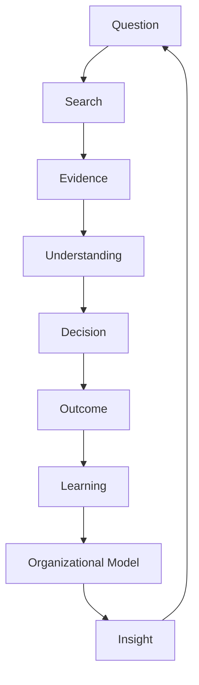

# Discovery Canonical Product Architecture

**Status:** Canonical
**Contract version:** 1
**Governed by:** [PRODUCT_GOVERNANCE.md](./PRODUCT_GOVERNANCE.md)

## Purpose

This document is Discovery's product-architecture constitution. It defines
what the product is, which objects own product meaning, and the boundaries
future work must preserve.

Changes to this architecture require evidence that the current architecture
cannot support the intended workflow.

## Product philosophy

Discovery is a governed organizational learning system. It helps authorized
people ask consequential Questions, form evidence-bounded answers, improve
those answers, make decisions, observe outcomes, retain learning, and improve
the Organizational Model.

A Question is not a transient investigation input. `ProductQuestion` is the
canonical long-lived product object. It accumulates references to searches,
answers, confidence, improvements, decisions, outcomes, learning, and insights.

## Canonical workflow



Search includes manual contribution until a governed connector is available.
Evidence admission and cognition remain authoritative upstream. Product
contracts project that authority; they do not recreate it.

## Canonical product objects

| Object | Owner | Responsibility | Persistence |
|---|---|---|---|
| `ProductQuestion` | `product/questions/` | Stable product identity, lifecycle, current references, histories, timeline | Versioned Question events in existing Organization Runtime memory |
| `ProductQuestionWorkspace` | `product/workflow/contracts.ts` | Complete frontend boundary for one Question | Projection; not an independent store |
| `ProductAnswer` | Product Workflow | Selected specific answer, evidence, uncertainty, improvement, optional decision implication | Referenced by durable Question history |
| `ProductAnswerConfidence` | Selected answer | Confidence in that exact answer and its principal limiter | Preserved with answer revision reference |
| `ProductDecisionDraft` | Product Workflow | Readiness-bounded draft that references Question and Answer | Projection of existing decision capability |
| `ProductDecision` | Executive Decision pipeline | Committed intervention and ancestry | Existing Runtime decision/work objects |
| `ProductOutcomeReview` | Executive Review/Learning | Comparison of expected and observed outcomes | Existing Runtime review and learning objects |
| `ProductModelState` | Product Workflow projection | Coverage, coherence, freshness, trustworthiness, tensions, growth | Projection of canonical Runtime state |
| `ProductInsight` | Product Workflow | Quality-gated, evidence-backed insight referencing Questions | Referenced by Question history |
| `ProductChangeReceipt` | Product Workflow | What changed, when, and which bounded product fields changed | Referenced by answer revision history |

These objects are versioned contracts. They may reference canonical objects;
they must not duplicate cognition or create parallel authority.

## ProductQuestion lifecycle

Allowed product states are:

```text
Created
→ Searching
→ Answered
→ Improving
→ Decision In Progress
→ Monitoring
→ Archived
```

Transitions are deterministic and validated. A Question owns exactly one
current Answer reference, at most one current Decision reference, and
append-only histories. Historical objects remain canonical at their existing
owners; the Question preserves lineage to them.

## Ownership boundaries

### Cognition

The engine owns evidence admission, observations, explanations, conditions,
uncertainty, investigation opportunities, recommendations, predictions, and
learning. Product code never alters those outputs or confidence.

### Runtime

Organization Runtime is canonical persistence. Question events use the
existing Runtime event collection and repository replacement contract. No
parallel Question database, identity, history store, or organization identity
is permitted.

### Product Workflow

Product Workflow selects and compresses already-authorized canonical outputs
into versioned product contracts. It owns customer-readable bounded language,
answer selection gates, abstention, and contract composition. It owns no
cognition.

### Frontend

The frontend is a renderer of `ProductQuestionWorkspace`. It may own layout,
visual hierarchy, interaction state, animation, disclosure, and accessibility.
It may not choose the answer, evidence, confidence, uncertainty, action,
change meaning, outcome meaning, model change, or insight eligibility.

### Canonical product adapter

`CanonicalProductWorkspaceAdapter` is the sole supported integration boundary
for future frontend reads and mutations. It authorizes before Runtime
retrieval, composes durable `ProductQuestion` lifecycle services with Product
Workflow, performs writes through optimistic Runtime repository replacement,
and returns a refreshed version-1 `ProductQuestionWorkspace`.

Legacy investigations enter through deterministic adoption receipts. Historical
Answers resolve only from an exact retained customer-safe Answer revision;
missing or incompatible content fails closed. The adapter never consumes legacy
presentation output, Product Communication internals, Runtime objects, or
cognition objects as a frontend contract.

## Projection firewall

The active product presentation must consume Product Workflow contracts. It
must not import Runtime, engine cognition, Product Communication internals, or
legacy data builders to determine product meaning.

Dependency direction is:

```text
Canonical cognition and Runtime
→ authorized projection
→ Product Workflow
→ ProductQuestionWorkspace
→ frontend presentation
```

Dependencies must never point back from engine or Runtime into product or
presentation code.

## Answer and confidence ownership

- The backend selects one current Answer or explicitly abstains.
- The frontend never combines, ranks, summarizes, or chooses answers.
- Confidence belongs to the exact selected Answer.
- Confidence never silently transfers to a condition, recommendation,
  prediction, evidence count, or organizational model.
- Every displayed confidence value preserves its authoritative source and
  principal limiter.
- Generic recommendations must abstain; intervention-specific evidence is
  required.

## Architectural invariants

1. Organization identity flows from authorization through Runtime and every
   product contract.
2. Unauthorized data is never retrieved to build a workspace.
3. Projection and rendering do not mutate Runtime.
4. Deterministic inputs produce byte-equivalent product contracts and
   rendering.
5. Product language may compress but may not reinterpret canonical meaning.
6. Unsupported content is omitted or represented by a bounded abstention.
7. Question, Answer, Decision, Outcome, Learning, and Insight lineage remains
   explicit.
8. Existing Runtime and cognition are composed before new infrastructure or
   primitives are proposed.
9. Contract changes require version, migration, fixture, validator, and
   documentation review.
10. Active and historical Questions remain organization-isolated.

## Related canonical documents

- [PRODUCT_GAPS.md](./PRODUCT_GAPS.md)
- [PRODUCT_ROADMAP.md](./PRODUCT_ROADMAP.md)
- [PRODUCT_DECISIONS.md](./PRODUCT_DECISIONS.md)
- [PRODUCT_GOVERNANCE.md](./PRODUCT_GOVERNANCE.md)
- [PRODUCT_CANON.md](./PRODUCT_CANON.md)
- [PRODUCT_COMMUNICATION_ARCHITECTURE.md](./PRODUCT_COMMUNICATION_ARCHITECTURE.md)
- [CANONICAL_PRODUCT_ROUTES.md](./CANONICAL_PRODUCT_ROUTES.md)
